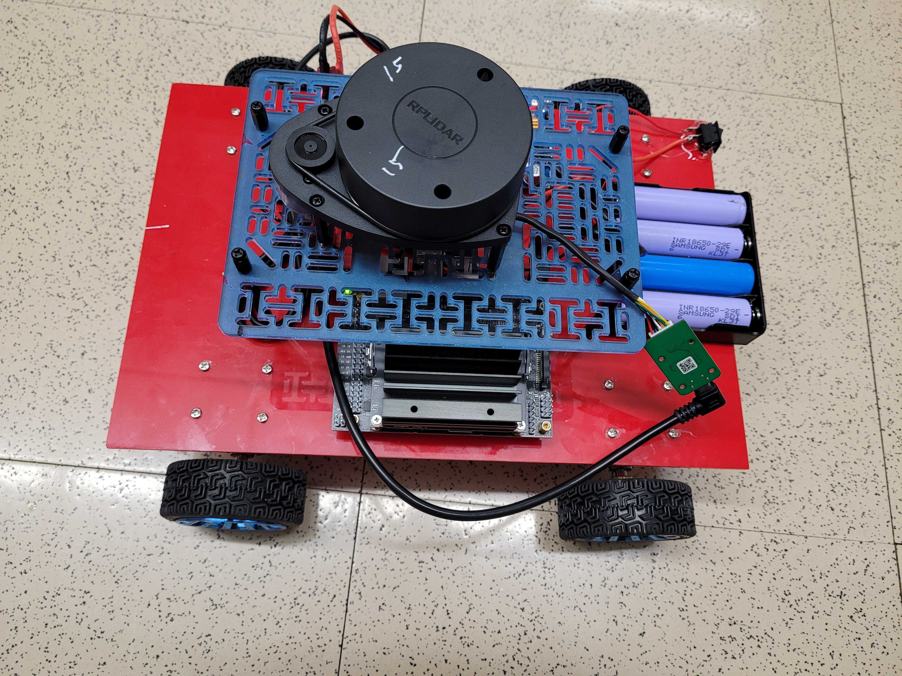
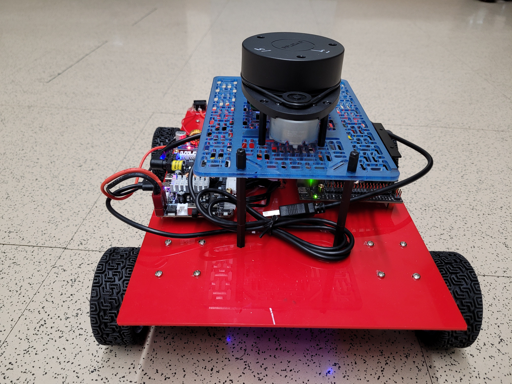
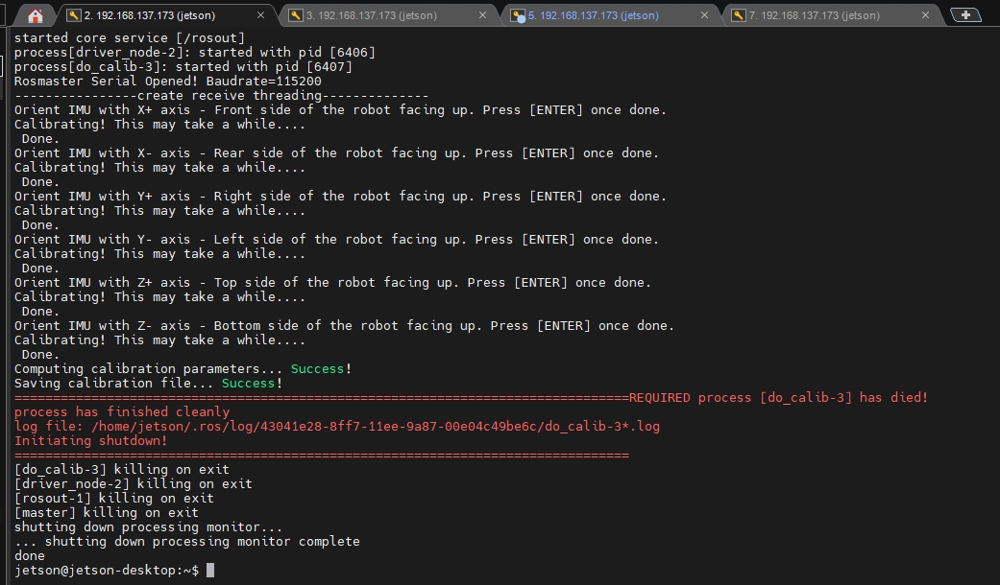
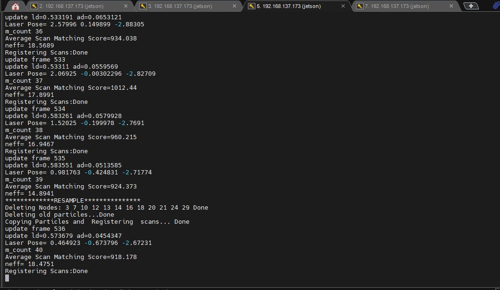
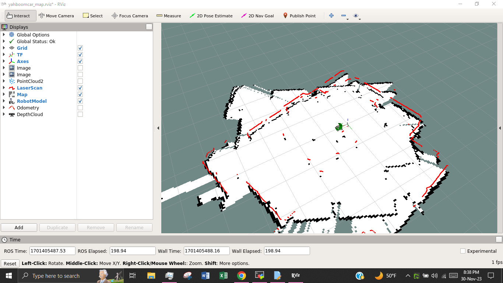
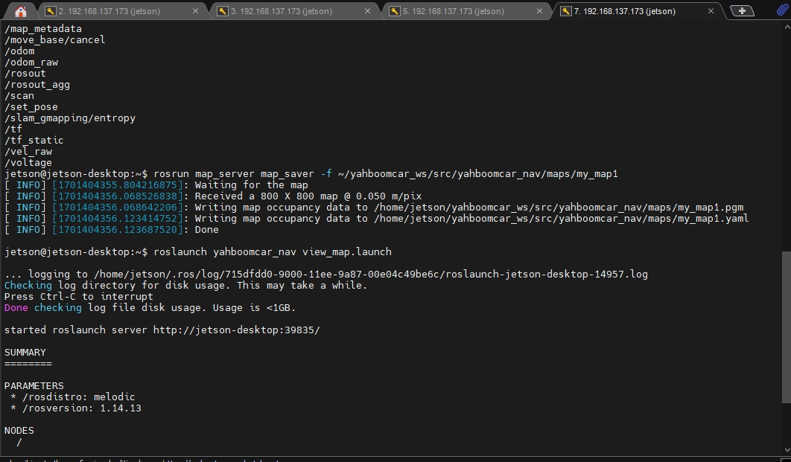

# Assignment 4 - Preliminary Robot Setup. Name: Tarek Zahid

## Problem Description
This directory contains the instructions on how to setup the robot for ECG711 course. Here are the steps we need to complete:
 * Setup basic robot like STM32, hardware setup like electrical connections voltage regulator
 * Setup STM32CubeIDE on the PC and validate the working of ROS controller
 * Install Ubuntu 18.04 on the jetson nano and install ROS melodic.
 * Perform robot calibration: imu calibration, linear velocity calibration, and angular velocity calibration
 * Perform Lidar SLAM and create an occupancy grid map

## Instructions
### Hardware Setup
We used the following components to build the robot:
* Jetson Nano 4GB as the main processor
* ROS Controller for motor control
* RPLidar A3
* 4 Motors
* 4 Wheels
* 12V Battery
* DC-DC Voltage Regulator
* A toggle button to control power
* A PS2 Joystickhttp://www.yahboom.net/study/ROSMASTER-X1
* A wifi dongle

We use 4 DC batteries, each around 4V in series connection to get around 16V in total. Then a DC-DC converter is used to step down the voltage level to 12V since ROS controller works on 12V. The voltage regulator is equipped with a potentiometer to regulate the level. 4 motors are connected with the ROS controller following instructions from http://www.yahboom.net/study/ROSMASTER-X1

ROS controller provides 5V Output power. We connect the output power to the input power of the Jetson nano as it takes 5V using the power transfer cable that comes with the ROS controller. For data transfer between nano and controller, we used the USB to micro USB cable. We build a separate base for the RPLidar as it needs an obstruction free view to map the environment. LiDAR is connected with the nano using the provided serial to USB cable. Below you can find two images of our Robot setup.http://www.yahboom.net/study/ROSMASTER-X1



### ROS Controller Setup
We installed the ROS Controller firmware using the STM32Programmer software. The firmware hex file can be found [here](https://drive.google.com/drive/u/1/folders/1rTNvBRIS7bLjqT_SyHcQLQt4VmSPToLm). After we burn the firmware, ROS controller is ready to communicate with a processor like Jetson nano. This firmware ensures proper data transfer like motor status, built in IMU sensor status, LED, Buzzer, and Voltage level. We will use its Python API named `Rosmaster_Lib` to read and write data.
### Ubuntu Image Installtion
We install Ubuntu 18.04 on our jetson nano. First, we take an SD card of 128GB and use an Ubuntu app called `Etcher` to burn the image on the SD card. We follow the instructions from the offical like [here](https://developer.nvidia.com/embedded/learn/get-started-jetson-nano-devkit). The whole process may take a few hours depending on internet speed and computer speed.

After that, we put the SD card to our nano and connect nano to the power output using the power adapter comes with nano. We connect a keyboard, mouse, and a display. As soon as plug the power, it will turn on as a regular computer. Next, we use the USB wifi dongle and setup the wifi connection. For now since we do not have any router, we are using wifi from our personal laptops. Then, we do some basic things like update apt repository and install Sublime text for code editing. 
Now, we install ROS melodic since Ubuntu 18.04 only supports this version. We follow official instructions from [here](http://wiki.ros.org/melodic/Installation/Ubuntu). We source the ROS in our Bash startup script also know as `bashrc` file.
To make our robot work, we need to install some other ROS Packages like `joy`, `gmapping`, `hector-mapping`,`rplidar-ros`, etc. We use command like `sudo apt install ros-melodic-joy` to install those packages from ROS apt repository.
Futher, we need to connect our nano to our ROS controller. So, first we connect the USB and then give it the permission to transfer data. We add the user to the dialout group by running the command 

`sudo usermod -a -G dialout jetson`

Then we crate a udev rule file by the name `myserial.rules` and copy to it `/etc/udev/rules.d`. The content of the rule file is following:

`KERNEL=="ttyUSB*", ATTRS{idVendor}=="1a86", ATTRS{idProduct}=="7523",  MODE:="0777", SYMLINK+="myserial"`

It basically gives the permission of serial data communication between the ROS Controller and nano and creates a symbolic link in `/dev/input` by the name `myserial`

Now, we follow a similar procedure for the RPLidar. We connect it to the nano and give permission by creating another rule file by the name `rplidar.rules` with the following content. 

`KERNEL=="ttyUSB*", ATTRS{idVendor}=="10c4", ATTRS{idProduct}=="ea60", MODE:="0777", SYMLINK+="rplidar"`

### Robot Calibration
Here, we calibrate the imu and motors. To do that, we first create a new ROS workspace and install `yahboom_ws` from [here](https://github.com/venki666/CpE476_demos/blob/master/2023/yahboom/yahboomcarX3_ws.zip). This workspace contains the ROS Packages to get the ROS Controller data and write data to motor. We build the workspace just like any other ROS workspace. Now, we install the Python API `Rosmaster_Lib` of the ROS Controller following instructions from [here](https://drive.google.com/drive/u/1/folders/1Bol3TN3sR6rXD_ZQwAddLu9It9PRhHXQ). We are using Python2 here. Next, we connect the joystick USB and RPLidar to our nano. We also setup ssh connection and connect the nano wirelessly to our personal computer using Mobaxterm software.

To calibrate the imu, we follow instructions from Lecture 9.7 of http://www.yahboom.net/study/ROSMASTER-X1. The imu is already calibrated by the manufacturer and calibration data is saved on `yahboom_bringup` package. To calibrate, we keep the robot on the respective positions as instructed like keep front side up or rear side up following instrucitons from http://www.yahboom.net/study/ROSMASTER-X1. We run command 

`roslaunch yahboomcar_bringup calibrate_imu.launch`

This starts imu node and calibration nodes.


Then, we calibrate the linear velocity of the robot. We set 1m disance and see if the robot really stops at 1m or not. Likewise,we follow instructions from [here](http://www.yahboom.net/study/ROSMASTER-X1). See the following video to get an idea.
   Linear Calibration
   [](https://www.youtube.com/watch?v=XvD1AUXTnqM)
   
Finally, we calibrate the angular velocity of the robot. We set the rotation angle to 360 and see if it really rotates 360. We find a little deviation here as the motors and our robot is not perfectly built. Sometimes, it rotates around 380-400 degree instead of 360. See the following video.
   [](https://www.youtube.com/watch?v=BJEDqafbIMc)


### Lidar SLAM

In this step, we test the lidar and create a map using `gmapping` ROS Package. We first use `bringup.launch` file from the `yahboom_bringup` package to turn on the robot. It launches robot motor driver, extended kalman filter sensor fusion, imu filter, and a joystick control node. We use the joystick to control the robot motion according to the instruction [here](https://github.com/venki666/CpE476_demos/blob/master/2023/yahboom/working_with_joy.md).

We run the following commands:
```
roslaunch  yahboomcar_nav  laser_bringup.launch
roslaunch  yahboomcar_nav  yahboomcar_map.launch  use_rviz:=false  map_type:=gmapping
roslaunch yahboomcar_nav view_map.launch
```

These launch files start lidar node, gmapping node, joystick controller, extended kalman filter node, and rviz node to visualize the map. Keep in mind, this process will be slow due to heavy data transfer. Also, for better performance, robot needs to move as slow as possible.



We can save the map by running the following command

`rosrun map_server map_saver -f ~/yahboomcar_ws/src/yahboomcar_nav/maps/my_map`

Before, we installed the `map_saver` package using apt.



