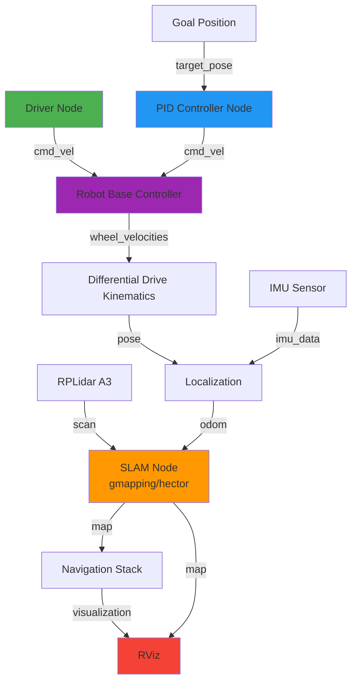

# AutoNav-ROS

### Autonomous Navigation ROS Platform

[](http://wiki.ros.org/melodic)
[](https://developer.nvidia.com/embedded/jetson-nano)
[](https://www.python.org/)
[](LICENSE)

> 📚 **Course Project**: ECG711 - Embedded Systems for Automation

An autonomous mobile robot platform built with ROS (Robot Operating System), featuring differential drive navigation, SLAM mapping, PID control, and real-world hardware implementation on Jetson Nano.

<div align="center">
  
  <p><i>Yahboom ROSMASTER X1 Robot with RPLidar A3 and Jetson Nano</i></p>
</div>

## Author

**Tarek Z**
YouTube Playlist: [ECG 711 Course Videos](https://www.youtube.com/playlist?list=PL-m3G6XXLHQtwv6o8FqcqjEjRjHKm8WNG)

## 🎯 Project Highlights

This repository demonstrates practical applications of embedded systems concepts in robotics, including:

- **ROS Architecture** - Multi-node communication and topic-based messaging
- **Differential Drive Kinematics** - Mathematical modeling and simulation
- **PID Control Systems** - Autonomous goal-seeking navigation
- **3D Robot Modeling** - URDF/XACRO for Gazebo and RViz
- **Sensor Fusion** - IMU and LiDAR integration
- **SLAM Implementation** - Real-time mapping with gmapping/Hector SLAM
- **Embedded Hardware** - Jetson Nano + STM32 motor control

## 📸 Visual Showcase

<table>
  <tr>
    <td align="center">
      
      <br/><b>RViz Robot Model Visualization</b>
      <br/>URDF modeling with sensor integration
    </td>
    <td align="center">
      
      <br/><b>PID Controller Navigation</b>
      <br/>Autonomous goal-seeking behavior
    </td>
  </tr>
  <tr>
    <td align="center">
      
      <br/><b>Real-time SLAM Mapping</b>
      <br/>Gmapping with RPLidar A3
    </td>
    <td align="center">
      
      <br/><b>Environment Map Output</b>
      <br/>Occupancy grid from SLAM
    </td>
  </tr>
</table>

## 🏗️ System Architecture



## 🛠️ Technologies Used

| Category | Technology |
|----------|-----------|
| **Framework** | ROS Melodic |
| **Programming** | Python 3 |
| **Simulation** | Gazebo, RViz |
| **Operating System** | Ubuntu 18.04 |
| **Computing Platform** | NVIDIA Jetson Nano |
| **Microcontroller** | STM32 (Motor Control) |
| **Sensors** | RPLidar A3, IMU |
| **Algorithms** | Gmapping SLAM, Hector SLAM, PID Control |

## 📚 Project Modules

### 🎮 [Assignment 1: Differential Drive Simulation](./Assignment%201)

Built the foundation for robot control with a driver-simulator architecture.

**Implementation:**
- **Driver Node**: Publishes differential wheel velocity commands via `cmd_vel` topic
- **Simulator Node**: Real-time pose calculation using differential drive kinematics

**Skills:** ROS topics, publishers/subscribers, differential kinematics, pose estimation

---

### 🎯 [Assignment 2: PID Controller for Goal Navigation](./Assignment%202)

Developed intelligent autonomous navigation using closed-loop PID control.

**Implementation:**
- **Driver Node**: Publishes target destinations as `Pose2D` messages
- **Controller Node**: PID-based trajectory planning with error minimization

**Skills:** PID tuning, feedback control systems, autonomous navigation algorithms

---

### 🤖 [Assignment 3: URDF Modeling and RViz Visualization](./Assignment%203)

Created accurate 3D robot models for simulation and visualization.

**Implementation:**
- URDF/XACRO robot description with sensor integration
- RPLidar A3 sensor model and mounting configuration
- Gazebo physics simulation and RViz real-time visualization

**Skills:** Robot modeling (URDF/XACRO), sensor integration, simulation environments

---

### ⚙️ [Assignment 4: Physical Robot Setup and Calibration](./Assignment%204)

Deployed the complete system on real hardware with full sensor integration.

**Implementation:**
- Hardware assembly: Jetson Nano + STM32 + motors + LiDAR + power system
- Ubuntu 18.04 and ROS Melodic installation on embedded platform
- Multi-stage calibration: IMU, linear velocity, angular velocity
- Real-world SLAM mapping using gmapping algorithm

**Skills:** Embedded Linux, hardware-software integration, sensor calibration, production robotics

---

## ✨ Key Features

- ✅ **Multi-Node ROS Architecture** - Distributed system design with topic-based communication
- ✅ **Differential Drive Control** - Mathematical modeling and real-time kinematics
- ✅ **PID-based Navigation** - Autonomous goal-seeking with tuned controllers
- ✅ **SLAM Mapping** - Real-time environment mapping using LiDAR
- ✅ **Sensor Fusion** - IMU and odometry integration for accurate localization
- ✅ **Hardware Integration** - Complete embedded system deployment on Jetson Nano
- ✅ **Simulation & Visualization** - Gazebo physics simulation and RViz 3D visualization
- ✅ **Production-Ready Calibration** - Systematic sensor and actuator tuning procedures

## Getting Started

### Prerequisites

- Ubuntu 18.04 (or compatible)
- ROS Melodic
- Python 3
- Catkin build system

### Basic Setup

1. Clone this repository:
   ```bash
   git clone https://github.com/tarekbzahid/ECG711-Embedded-Systems-for-Automation.git
   cd ECG711-Embedded-Systems-for-Automation
   ```

2. Navigate to the specific assignment directory:
   ```bash
   cd "Assignment 1"  # or Assignment 2, 3, 4
   ```

3. Follow the instructions in each assignment's README for detailed setup and execution steps.

### Building a Catkin Workspace (General)

```bash
mkdir -p ~/catkin_ws/src
cd ~/catkin_ws/
catkin_make
source devel/setup.bash
```

## Project Structure

```
ECG711-Embedded-Systems-for-Automation/
├── Assignment 1/          # Differential drive simulation
│   ├── catkin_ws/
│   ├── images/
│   └── README.md
├── Assignment 2/          # PID controller navigation
│   ├── catkin_ws/
│   ├── images/
│   └── README.md
├── Assignment 3/          # URDF modeling and visualization
│   ├── catkin_ws/
│   ├── images/
│   └── README.md
├── Assignment 4/          # Physical robot setup
│   ├── images/
│   └── README.md
└── README.md              # This file
```

## Resources

- **Course Videos**: [YouTube Playlist](https://www.youtube.com/playlist?list=PL-m3G6XXLHQtwv6o8FqcqjEjRjHKm8WNG)
- **ROS Documentation**: [http://wiki.ros.org/](http://wiki.ros.org/)
- **Yahboom ROS Controller**: [http://www.yahboom.net/study/ROSMASTER-X1](http://www.yahboom.net/study/ROSMASTER-X1)

## 📄 License

This project was developed as part of ECG711 (Embedded Systems for Automation) coursework and is intended for educational purposes.

## Acknowledgments

- Course instructor and teaching assistants
- Yahboom for robot hardware and documentation
- ROS community for excellent documentation and packages
